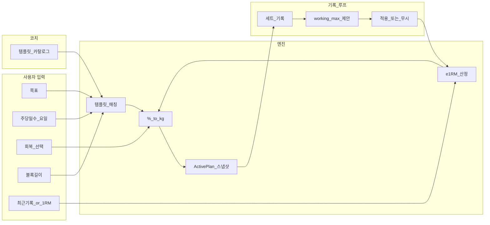

# 계획: 목표 → 루틴 생성 → 살아 있는 e1RM

> 작성: 2026-09-10 · **계획 전용** (이 문서 작성 시점 기준 앱 소스 미수정)  
> 배경: [갭 분석](2026-09-10-brief-vs-current-gap-analysis.md)의 최대 괴리  
> 전제: 생성형 AI가 아니라 **코치 템플릿 + 결정론 계산**. 기존 `createActivePlan` / D5 / 관리자 템플릿을 확장한다.

---

## 0. 한 줄 목표

사용자가 **목표·훈련 일수·(선택) 회복·블록**만 정하면, 코치가 준비한 틀 위에서 **오늘 할 무게가 처방**되고, 기록을 남길수록 **working max(e1RM)가 갱신 제안→적용**되어 이후 % 처방이 따라가게 한다.

---

## 1. 제품 분해 (세 레이어)

지금은 “선택형 러너”만 있다. 생성기를 한 덩어리로 짜지 말고 레이어를 나눈다.

| 레이어 | 역할 | 누가 만드나 | 지금 자산 |
|---|---|---|---|
| **A. 템플릿** | 주 분할, DUP 패턴, 블록 프리셋, 운동·세트·%표 | 코치(관리자) | `main_admin`, programs JSON |
| **B. 숫자 엔진** | RM→e1RM, %→kg 반올림, 회복 상한, 갱신 제안 | 앱(순수 함수) | `percentOfBaseline`, D5 패턴 |
| **C. 의도 UX** | 온보딩/프로필 입력, postpone, 종목 이월 | 사용자 | 일정 이동(LC02), 온보딩 셸 |

**살아 있는 e1RM**은 B의 상태이고, **목표만 정하면 루틴**은 A∩C로 템플릿을 고르고 B로 채우는 것이다.

---

## 2. 구현 단계 (권장 순서)

오류 없이 움직이려면 **표시 → 수동 채택 → 제안 갱신 → (나중) 소폭 자동** 순이 안전하다. 한 번에 “완전 오토파일럿+자동 e1RM”을 열지 않는다.

### Phase 0 — 계약만 고정 (문서·결정, 코드 최소)

결정할 것 (미정 시 구현 금지):

1. **e1RM 공식** — **확정(2026-09-10):** Epley `w*(1+r/30)`, 정책 id `e1rm-epley-v1`. 카피: 반드시 **추정**.  
2. **채택 조건** — **확정:** 작업 세트만, 반복 1–12, RIR 미입력 또는 ≤4. 워밍업·초안·제외·0kg 제외.  
3. **baseline vs e1RM** — Phase 1은 working max **저장·표시만**. baseline/% 재필은 Phase 2. 과거 목표 불변.  
4. **템플릿 매칭 키** — Phase 2.  
5. **피처 플래그** — `LIVE_E1RM_V1` (default true).  

**완료 기준:** 위 5항이 한 페이지 정책 문서에 숫자·제외 조건과 함께 적힘. → Phase 0/1 코드에 `lib/domain/e1rm.dart`로 고정.

---

### Phase 1 — “살아 보이는” e1RM (생성기 없이)

목적: 기록 탭·프로필에서 e1RM이 **계산·표시**되고, 사용자가 **채택**하면 이후 처방 기준이 된다.

| 작업 | 내용 |
|---|---|
| 도메인 | `estimateE1rm(kg, reps, {rir?})` 순수 함수 + 단위 테스트 (고정 입출력 표) |
| 저장 | 리프트별 `WorkingMax { valueKg, source, method, adoptedAt }` (계획과 분리된 사용자 메타) |
| UI | 기록 추세 옆에 e1RM 점/선(데이터 없는 날은 빈칸). 당일 상세에서 “이 세트로 추정 → 적용?” |
| 연결 | 적용 시 해당 리프트 baseline 갱신. **이미 시작된 plan의 과거 목표는 재계산하지 않음**(현행 스냅샷 불변). 미래 미기록만 재필 옵션은 Phase 2 |

**완료 기준:** 동일 입력 → 동일 e1RM. 적용/취소가 D5처럼 이력으로 남음. 기존 349계열 회귀 깨지지 않음.

**진행(2026-09-10):** 추정·제안·수동 채택·`working-max.json`·기록 추세 UI·채택 시 activePlan baseline + **미래 미기록 % 재필**(Phase 3와 동일)·새 프로그램 시작 시 working max 미리채움. 과거·기록 세트 목표는 불변.

**아직 안 함(Phase 1 시점):** 목표만으로 루틴 생성, 자동 증량. (미래 재필·라이브 제안은 Phase 3.)

---

### Phase 2 — “목표만 정하면 루틴” MVP (템플릿 매칭)

목적: 온보딩/프로필 **생성 마법사**가 코치 템플릿을 고르고, Phase 1 working max로 kg를 채운 **ActivePlan**을 만든다.

| 단계 | UX | 엔진 |
|---|---|---|
| 1 | 목표 3택 | 매칭 키 |
| 2 | 주당 N일 + 요일 | 매칭 + 일정 배치(기존 createActivePlan 일정 로직) |
| 3 | 블록 프리셋 (4+4 등) 또는 단일 블록 길이 | 템플릿의 블록 메타 / 연결 프로그램 시퀀스 |
| 4 | 메인 리프트 최근 기록(또는 1RM) | → e1RM 제안 → 확인 → WorkingMax |
| 5 | (선택) 회복 3슬라이더 | Phase 2에서는 **악세 상한 프리셋만**(세트 −0/1/2). 복잡한 Neural Load는 후순위 |
| 6 | 미리보기(주간 요약·시작 중량) → 시작 | `createActivePlan` + `%` 채움 |

**코치 측 선행:** 목표×일수 조합마다 **최소 1개 템플릿**이 관리자 카탈로그에 있어야 한다. 없으면 생성기 CTA를 열지 않거나 “준비 중” — 빈 알고리즘 생성 금지.

**DUP:** 별도 알고리즘이 아니라, 코치가 요일별로 다른 세션을 넣은 템플릿을 `goal=…, tag=dup`로 등록. 생성기는 태그만 고른다.

**완료 기준:** 플래그 on일 때 마법사 → 오늘 탭에 처방 kg. 플래그 off면 기존 선택형 경로만.

**진행(2026-09-10):** `GENERATOR_V1` + 목표 3택×주당일수 매칭 표 + `RoutineGeneratorScreen`(목표→일수→블록·회복·요일·기준중량→시작). habit×4=상하분리 템플릿. 매칭 실패는 하드 스톱. 수면·영양·스트레스 점수 엔진·DUP 전용 모드는 미구현.

---

### Phase 3 — “살아 움직임” (기록 루프)

D5를 일반화한다.

| 이벤트 | 동작 |
|---|---|
| 작업 세트 저장(조건 충족) | 새 e1RM 후보 계산. **자동 덮어쓰기 금지**. “working max 92.5→95 제안” 시트 |
| 사용자 적용 | WorkingMax 갱신 + **이후 미래 미기록 세션**의 해당 리프트 % 목표만 재계산(과거·완료분 불변) |
| 연속 실패/높은 RIR | 기존 D5 감량 제안과 통합(충돌 시 **회복·감량 우선** — 06 엔진 원칙) |
| 되돌리기 | 직전 WorkingMax + 직전 미래 목표 스냅샷 복구 |

**완료 기준:** 적용 전후 이유 한 줄, 되돌리기 1회, 동일 입력 재현(엔진 버전·공식 버전 저장).

**진행(2026-09-10):** 세트 저장 후 조건 충족 시 제안 다이얼로그 → 적용 시 `WorkingMax` + baseline + **미래 미기록 % 목표 재필** + SnackBar 되돌리기 1회. **활성 D5 감량이 있으면 WM 제안 숨김(감량 우선)**. 영구 채택 이력 테이블은 미구현.

---

### Phase 4 — 오토파일럿 유연성 (생성기와 별도 트랙으로 가능)

원문의 postpone / 종목 이월은 e1RM과 독립이다. 병렬 가능하나 **Phase 2 스냅샷 모델 안정 후**가 안전.

1. **세션 postpone:** LC02 위에 “오늘 → 다음 가능 요일/날짜” 원탭.  
2. **종목 이월:** 세션을 `doneExercises + deferredQueue`로 쪼개는 도메인. 다음 세션 앞에 큐 병합 규칙(최대 n종목, 우선순위).  

이것 없이 Phase 1–3만으로도 “목표→생성→e1RM 생존” 괴리의 **핵심**은 메워진다.

**진행(2026-09-10):** 기록 없는 오늘/미래 세션 **다음 훈련일 미루기** + 종목 **다음에 하기**(필수 세트 이월 표시·오늘 탭 큐). 느슨한 스케줄러·다음 세션 자동 병합은 미구현.

---

## 3. 데이터·경계 (실수하기 쉬운 곳)

1. **스냅샷 불변:** 완료된 세트·과거 목표 kg는 e1RM이 바뀌어도 다시 쓰지 않는다.  
2. **baseline 용어:** UI/코드에서 e1RM·working max·프로그램 기준중량을 동의어로 섞지 않는다.  
3. **템플릿 버전:** 생성 시점 프로그램 version을 plan에 박제(현행과 동일).  
4. **의료 표현 금지:** 회복 슬라이더는 “운동량 상한 힌트”이지 진단이 아님.  
5. **매칭 실패 = 하드 스톱:** 추측 생성으로 빈 주간을 채우지 않음.  
6. **시험:** 엔진은 테이블 드리븐 단위 테스트 필수. UI는 플래그 on/off 위젯 시험.

---

## 4. 화면 진입점 (계획)

| 시점 | 진입 |
|---|---|
| 가입 후 첫 홈(플랜 없음) | “루틴 만들기” → Phase 2 마법사 |
| 프로필 | 목표·요일·블록·working max 재설정 (미래만 영향) |
| 기록 | e1RM 추세 + 점 탭 시 근거 세트 |
| 오늘 | 처방 kg. 조절 배너(제안 있을 때만) |

기존 “프로그램 선택” 경로는 플래그로 유지해 **회귀·코치 QA**에 쓴다 (wiggle room).

---

## 5. 대략 마일스톤 (일정 숫자는 추정)

| Phase | 산출물 | 의존 |
|---|---|---|
| 0 | 공식·조건·매칭 키 문서 | 코치와 공식 합의 |
| 1 | e1RM 표시·채택 | Phase 0 |
| 2 | 생성 마법사 + 템플릿 N종 | Phase 1 + 관리자 템플릿 채워짐 |
| 3 | 기록→제안→미래 재필 | Phase 1–2 |
| 4 | postpone / 종목 이월 | Phase 2 안정 |

코치가 템플릿을 안 채우면 Phase 2는 열지 않는 것이 “오류 없는 구동”에 맞다.

---

## 6. 의도적으로 나중에 할 것

- 완전 자동 working max 덮어쓰기  
- Fitbod급 종목 자동 교체  
- 게시판·인앱 유튜브·실결제 (생성기 핵심 경로와 분리)  
- 복잡한 Neural Load 시뮬레이터 전부 회복 3슬라이더 상한만

---

## 7. 성공 정의 (이 괴리가 줄었다고 말할 조건)

1. 신규 사용자가 프로그램 목록을 고르지 않고도 **목표 플로우만으로** 오늘 처방을 받는다(템플릿이 있는 조합에 한해).  
2. 기록 후 working max **제안→적용**이 동작하고, 다음 미수행 세션 kg가 바뀐다.  
3. 과거 기록·완료 목표는 변하지 않는다.  
4. 플래그 off 시 기존 선택형 앱과 동일하게 동작한다.

---

## 8. 다음 액션 (코드 전)

1. Phase 0 정책 문서에 쓸 **공식 1개 + 채택 조건**을 코치가 고른다.  
2. 목표×주당일수 매트릭스에 **최소 템플릿 목록**을 적는다 (DUP 포함 여부).  
3. Phase 1부터 플래그 달고 구현 착수 여부를 결정한다.
